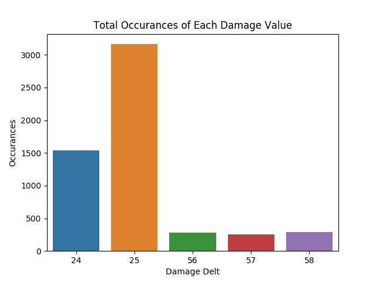
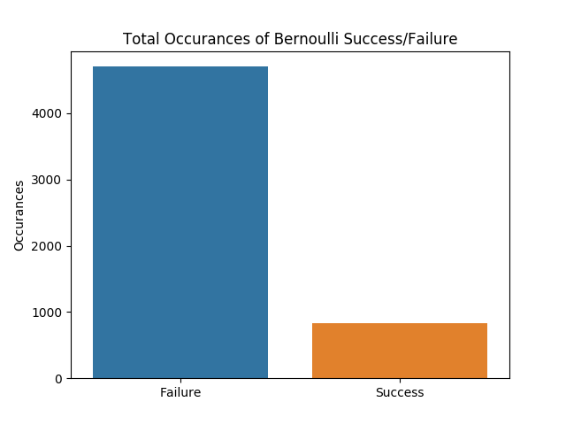

# Analysis of Random Event Generation in Computer Gaming 


## Introduction

  In modern computing, the generation of events with specific probabilities has been considered a necessary tool for applications ranging from executing computer simulation models, to running gambling machines. Another field where this is prevelant is in eSports, or competitive video gaming. With viewership [quickly growing and experts ancitipating it to become a billion dollar industry](http://www.businessinsider.com/esports-popularity-revenue-forecast-chart-2017-3), understanding the mechanism by which these games function can have major impacts. 
  
  In this paper I will explore the usage of random event generation in the computer game Dota 2 and compare the stated probabilities and expected results to collected gameplay data.
  
  [General information about Dota 2 can be found here.](https://en.wikipedia.org/wiki/Dota_2)
  
  First we will walk through the application of a Monte Carlo experiment in order to generate data within the game, followed by the processing of this data. After, we will discuss the methods of the statistical tests utilized and end with our finalized results and conclusions.    

## Data Collection and Structure
  The first step of this experiment is to collect a large number of trials of one type of event in Dota 2, constituting a form of [Monte Carlo experiment](https://en.wikipedia.org/wiki/Monte_Carlo_method). Without diving too far into the details of the game, in our experiment we are observing the repeated attack by one player who has a stated 15% chance to deal bonus damage in order to compare the frequency of the attack bonus triggering (event sucess) to a true random event with sucess of 15%. While only one specific type of interaction is being tested, we can reasonably assume this random event generation mechanic extends beyond this specific instance.
  
  The events of the controlled in-game environment can be exported as a [log file](test.txt), automatically generating one entry for each event. Below is a sample:

```
{
	type: 0
	target: npc_dota_hero_axe
	target_source: npc_dota_hero_axe
	attacker_name: npc_dota_hero_phantom_assassin
	damage_source: npc_dota_hero_phantom_assassin
	is_attacker_illusion: 0
	is_attacker_hero: 1
	is_target_illusion: 0
	is_target_hero: 1
	is_visible_radiant: 1
	is_visible_dire: 1
	value: 24
	value: 7466
	timestamp: 2184.620
	last_hits: 0
}
```
  For the purposes of this analysis, we are concerned with "target" or "target_source", "attacker_name" or "damage_source", and the first "value" entry which represents the damage done. 
  
  We begin the script by importing our needed packages as well as our data.
```python
import matplotlib.pyplot as plt
import numpy as np
import pandas as pd
from scipy import stats
import math


with open('test.txt') as f:
	data = f.read()

data = [x.lstrip('\t}\n').split('\n\t') for x in data.split('\n}\n{\n')]
```
  Standard I/O functions from packages such as Pandas and Numpy do not work on this specific dataset's unique structure, so a line comprehension is used to break the data into a 2-dimensional array. In other words, we create a list of lists, with each list entry representing one event and each string entry representing an attribute of the event. The aforementioned event will be represented like so:
  
```
['type: 0', 'target: npc_dota_hero_axe', 'target_source: npc_dota_hero_axe', 'attacker_name: npc_dota_hero_phantom_assassin', 'damage_source: npc_dota_hero_phantom_assassin', 'is_attacker_illusion: 0', 'is_attacker_hero: 1', 'is_target_illusion: 0', 'is_target_hero: 1', 'is_visible_radiant: 1', 'is_visible_dire: 1', 'value: 24', 'value: 7466', 'timestamp: 2184.620', 'last_hits: 0']
```

  The dataset will also include entries not relevent to our analysis so a filter must be applied. Below is the iteration over the full dataset, where only entries of ```type: 0``` with our character in question as the "attacker_name" are included. If an entry meets this criteria, our value of interest (the damage dealt) will be added to the list ```dmg```.

```python
for x in data:
  try:
    if x[0] == 'type: 0' and x[3] == 'attacker_name: npc_dota_hero_phantom_assassin':
	dmg_val = x[11].split('value: ')[1]
	dmg_val = int(dmg_val)
	dmg.append(dmg_val)
    except IndexError:
      pass
```
<b>Note:</b> The usage of the error exception ```IndexError``` is needed since events of different types have different numbers of attributes and entries short enough will cause our script to fail. No data of interest is lost due to this exception since no events of ```type: 0``` will cause an ```IndexError```. 

After the ```dmg``` array is populated with the results from our Monte Carlo experiment, the data must be converted to Beroulli Sucess/Failure trials for further analysis. Based on the results seen in Figure 1, a clear divide can be made between the higher damage success trials and the lower damage failure trials. 

```python
dmg = np.array(dmg)
dmg_count = np.unique(dmg,return_counts=True)

x_axis1 = np.arange(5)
plt.figure(1)
plt.xlabel('Damage Delt')
plt.ylabel('Occurances')
plt.title('Total Occurances of Each Damage Value')
sns.barplot(x_axis1,dmg_count[1])
plt.xticks(x_axis1,dmg_count[0])
plt.show()
```


Figure 1: Occurance of damage values for all trials of the in game Monte Carlo experiment 




